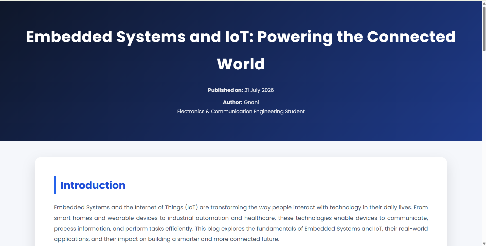
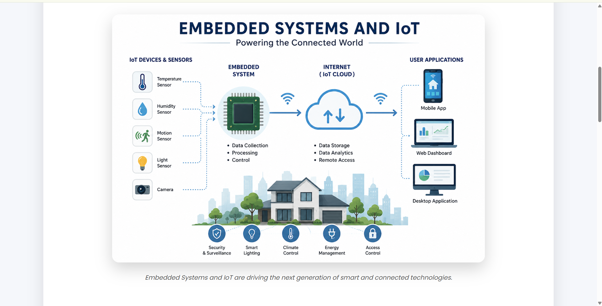
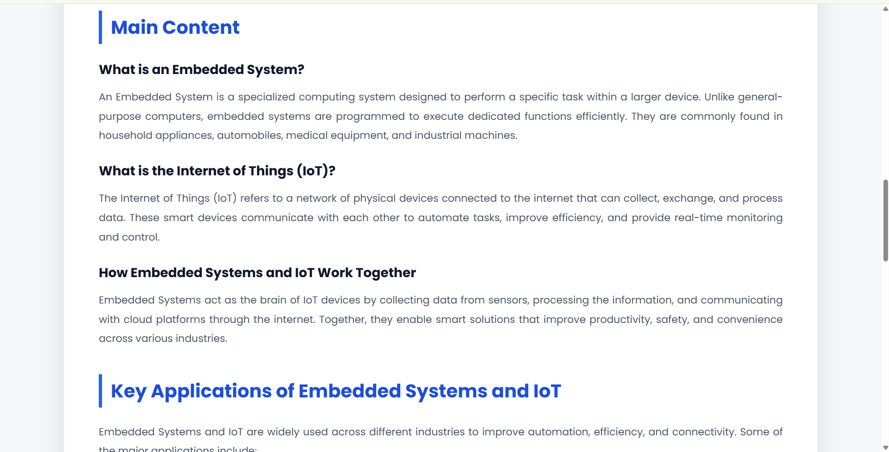
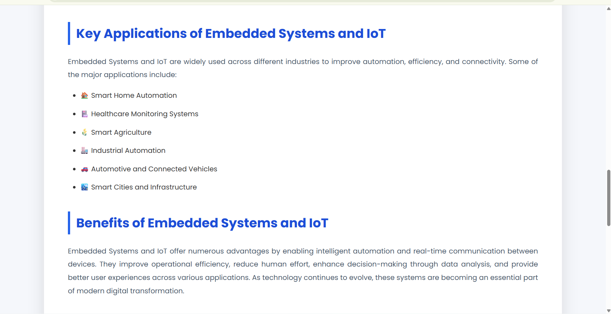
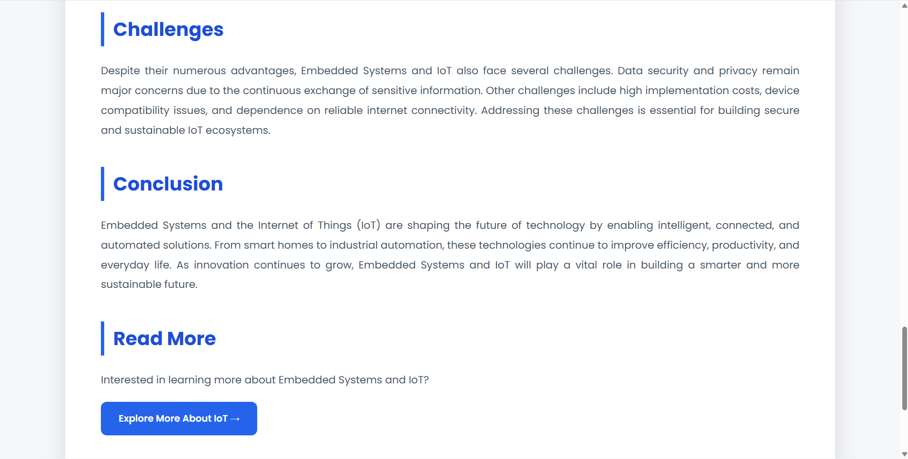
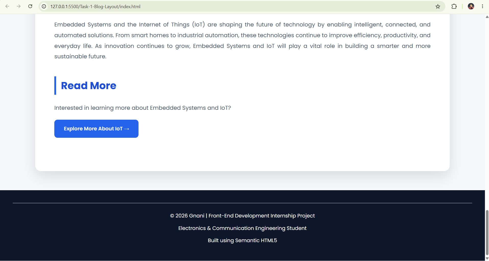

# 🌐 Task 1 - Embedded Systems and IoT Blog Layout

## 📖 Overview

This project was developed as **Task 1** of my **Front-End Development Internship** at **SaiKet Systems**.

The objective was to create a semantic HTML blog post layout that presents technical content in a clean, structured, and user-friendly format. The blog focuses on **Embedded Systems and the Internet of Things (IoT)**, explaining their concepts, applications, benefits, and challenges.

---

## 🎯 Objective

Design a blog post using semantic HTML elements while maintaining a clean layout and professional presentation.

---

## 🚀 Features

- Semantic HTML5 structure
- Professional blog layout
- Responsive design
- Featured image with caption
- Publication date using the `<time>` element
- Author information
- Structured content sections
- Real-world applications list
- Read More button
- Modern UI with CSS
- Mobile-friendly design

---

## 🛠️ Technologies Used

- HTML5
- CSS3
- Google Fonts (Poppins)

---

## 📂 Project Structure

```text
Task-1-Blog-Layout/
│
├── assets/
│   └── images/
│       └── embedded-iot.jpg
│
├── index.html
├── style.css
└── README.md
```

---

## 📸 Project Preview

Below are screenshots showcasing different sections of the project.

### Home Page



### Introduction Section



### Featured Image Section



### Applications & Benefits



### Challenges & Conclusion



### Mobile Responsive View



---

## 📚 What I Learned

During this project, I gained practical experience in:

- Semantic HTML5
- Page structure using semantic elements
- Responsive web design
- CSS styling and layout
- Typography and spacing
- Accessibility best practices
- Organizing front-end projects professionally

---

## 📈 Future Improvements

- Dark mode
- Reading progress bar
- Social sharing buttons
- Back-to-top button
- Better animations
- Enhanced accessibility

---

## 👨‍💻 Author

**Gnani**

Electronics & Communication Engineering Student

Front-End Development Intern @ SaiKet Systems

---

## 📄 License

This project was created for educational purposes as part of the SaiKet Systems Front-End Development Internship.
